# 📊 Charlotte Hornets - Análise e Previsão de Desempenho na NBA

## 📌 Descrição do Projeto
Este projeto foi desenvolvido para analisar e prever o desempenho do time Charlotte Hornets na NBA, utilizando dados das temporadas 2023-24 e 2024-25. A aplicação utiliza **Streamlit** para visualização interativa, **nba_api** para extração de dados, além de modelos estatísticos e de aprendizado de máquina para previsões de eventos extremos e estatísticas dos jogadores.

## 🚀 Funcionalidades
### 🔹 Extração e Análise de Dados
- Coleta de estatísticas dos jogos do Charlotte Hornets via **nba_api**.
- Classificação e desempenho do time na temporada 2024-25.
- Exibição de métricas como vitórias, derrotas, jogos em casa e fora.

### 🔹 Modelos Estatísticos e Preditivos
- **Método de Gumbel** para modelagem de eventos extremos.
- **Regressão Linear e Logística** para previsão de pontos, assistências e rebotes.
- **GAMLSS (PoissonGAM e LinearGAM)** para prever o desempenho dos jogadores em jogos futuros.

### 🔹 Visualizações Interativas
- **Gráficos de Barras e Radar** para comparação de estatísticas.
- **Curva ROC e Matriz de Confusão** para avaliação de modelos preditivos.
- **Gráficos de Probabilidade Predita e Coeficientes** para melhor interpretação das previsões.

## 📦 Tecnologias Utilizadas
- **Python 3.11**
- **Streamlit** - Para construção da interface interativa.
- **pandas** - Manipulação e análise de dados.
- **plotly_express** - Visualizações gráficas.
- **nba_api** - Extração de dados da NBA.
- **scikit-learn** - Modelos de aprendizado de máquina.
- **numpy** - Operações numéricas.
- **scipy** - Modelos estatísticos.
- **jupyter** - Desenvolvimento e testes de modelos.

## 📌 Como Executar a Aplicação
### 🔹 Pré-requisitos
- Ter o **Python** instalado (versão 3.7 ou superior).

1. Clone o repositório:
   ```bash
   git clone https://github.com/seu-usuario/seu-repositorio.git
   ```
2. Acesse o diretório do projeto:
   ```bash
   cd seu-repositorio
   ```
3. Crie um ambiente virtual e ative-o:
   ```bash
   python -m venv venv
   source venv/bin/activate  # Para Linux/Mac
   venv\Scripts\activate  # Para Windows
   ```
4. Instale as dependências:
   ```bash
   pip install -r requirements.txt
   ```

### 🔹 Rodando a Aplicação
Execute o seguinte comando no terminal:
```bash
streamlit run Charlotte❤️Hornets.py
```
Isso abrirá a interface da aplicação no navegador.

## 📊 Exemplos de Visualizações
- **Métricas do Charlotte Hornets**
- **Gráficos de Probabilidade e Distribuição**
- **Predição de Pontuação dos Jogadores**

## 📷 Galeria Interativa

  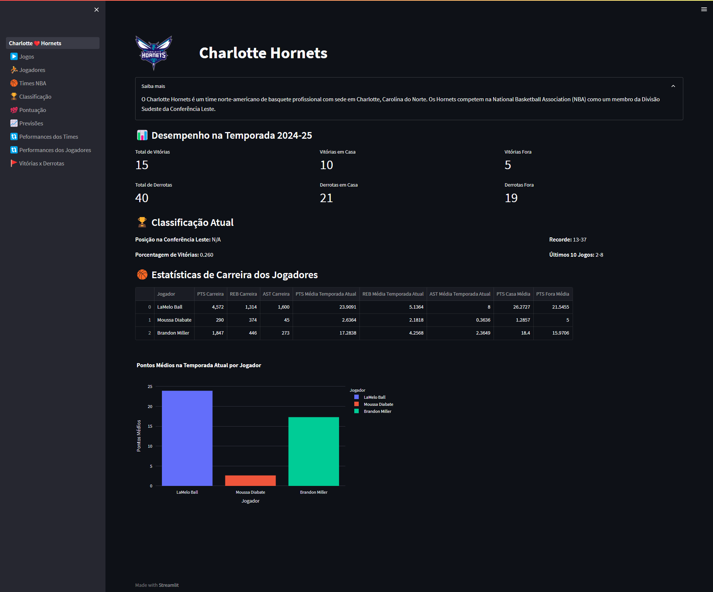

<details>
  <summary>📌 Veja mais</summary>
  
  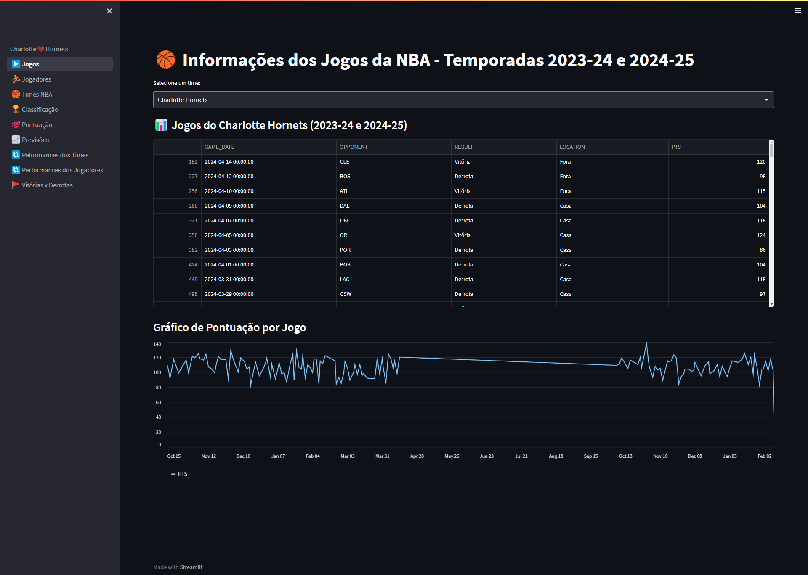
  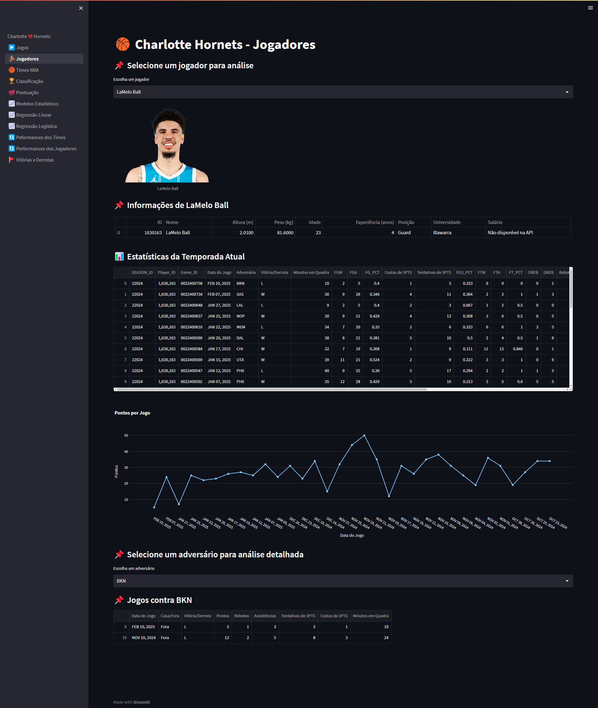
  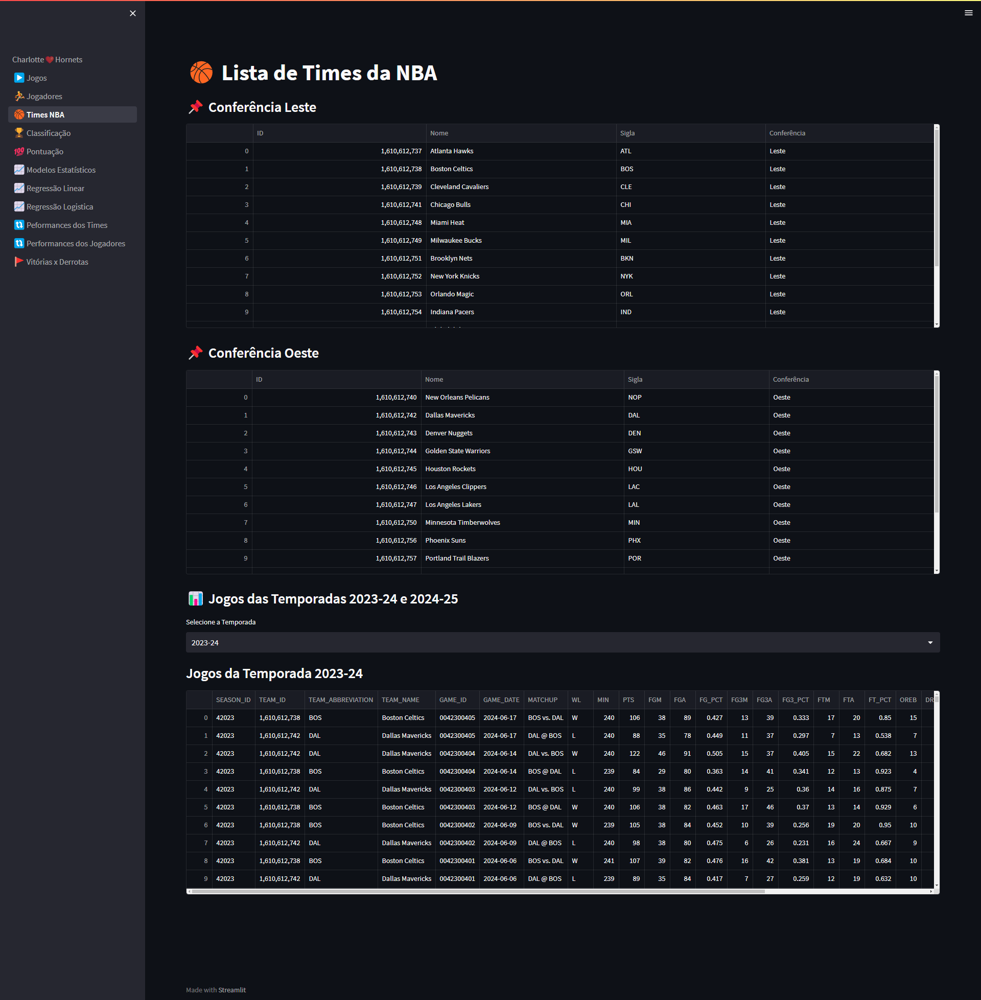
  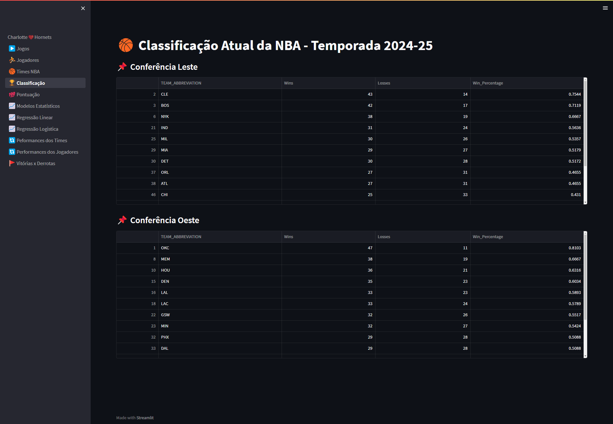
  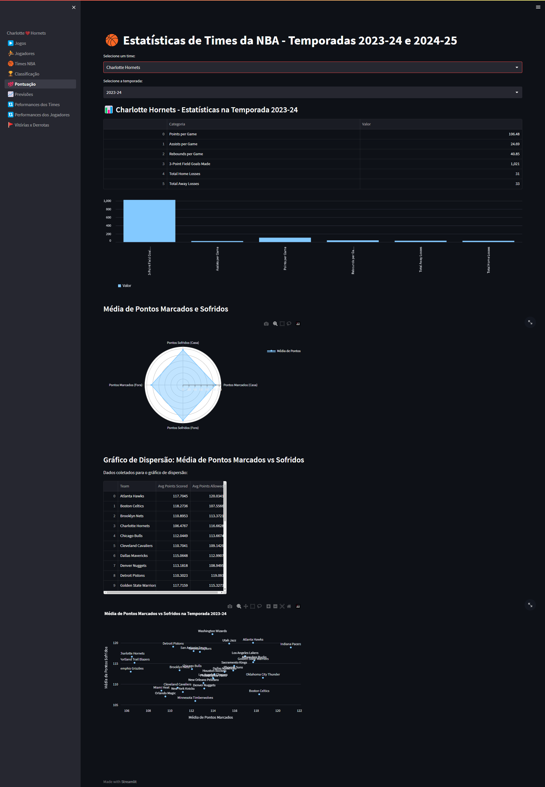
  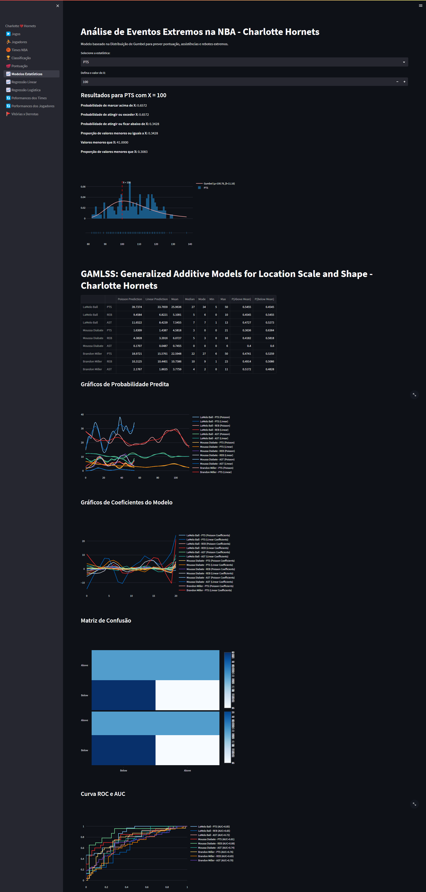
  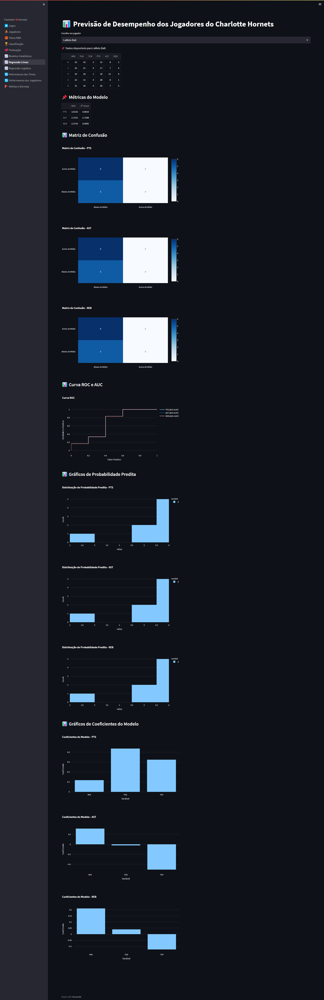
  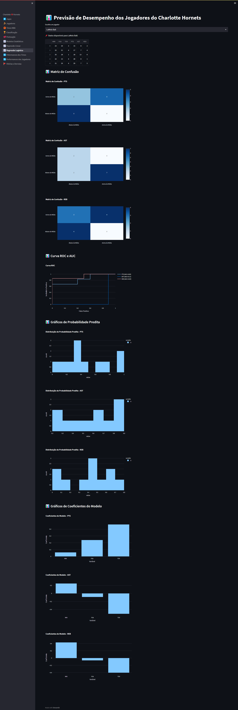
  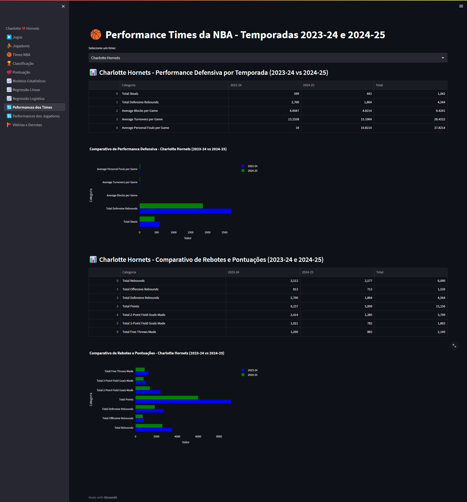
  
  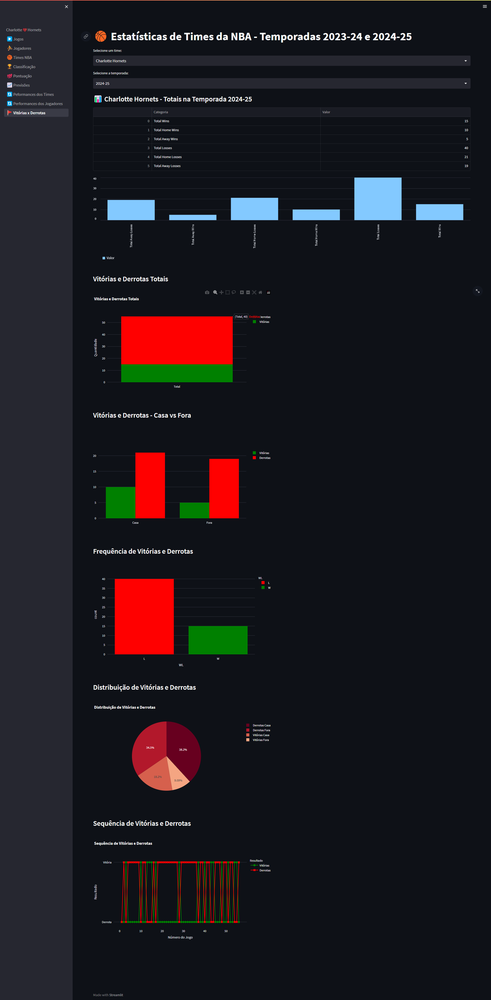

</details>


## 🏀 Referências
- API Oficial da NBA: [nba_api](https://github.com/swar/nba_api)
- Documentação do Streamlit: [streamlit.io](https://streamlit.io/)
- Fundamentos de Ciência de Dados - UFAPE

## 📝 Autores
**👨‍💻 Discentes**
- [Genário Correia](https://github.com/genarioazevedoufape)
- [Matheus Henrique](https://github.com/MatheusHAlvess)

Este projeto foi desenvolvido por  no âmbito da disciplina **Fundamentos de Ciência de Dados** na **Universidade Federal do Agreste de Pernambuco (UFAPE)**, sob orientação dos professores **Ryan Azevedo & Assuero Ximenes**.


